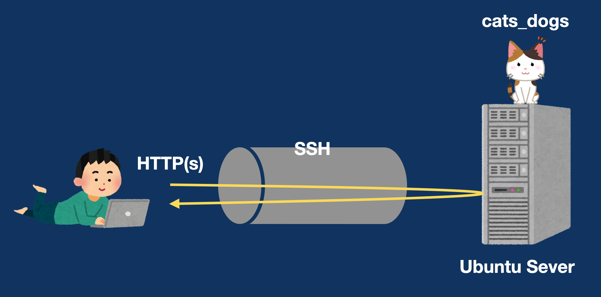

# cats_dogs を使うためのサンプル



このリポジトリは [cats\_dogs(CAT'S DOCument System)](https://github.com/1f408/cats_dogs) を利用する際の、サンプルを提供します。  
設定ファイルは、[config](./config/etc) に用意していますので、参考としてください。

また、試しに動かしてみたい方は、以下の要望に合わせて、動作環境の作り方をYoutube上で[提供](https://www.youtube.com/playlist?list=PLTKODctBx8g-gmC8lrM2KeRM5N7qXCdcE)しています。

1. [CATS\_DOGS を使えるようにしよう](https://youtu.be/MMyKtsIiggk)
2. [CATS\_DOGS を使うための準備](https://youtu.be/jH_t0qBZlwY)
3. [ブラウザで Markdown をみてみよう](https://youtu.be/vfTsRSdkK1U)
   - [動画上でこのサンプルを使います](./demo/step1)
4. [人によって見せる内容をかえよう](https://youtu.be/XHFfSlsTooo)
   - [動画上でこのサンプルを使います](./demo/step2-3)
5. [好きなエディタで書けるようにしよう](https://youtu.be/XX8g0s2dua4)
   - 4 と同じサンプルを使います
6. [簡単な UI を使えるようにしよう](https://youtu.be/IL13gvWAgFM)
   - [動画上でこのサンプルを使います](./demo/step4)

動画視聴に際し、以下の内容を、事前に準備してください。

## 事前準備

動画で使用する環境は、以下のとおりです。

- **OS**: Ubuntu Server 22.04.1 LTS
  - **account name**: demo

仮想環境（VMware、VirtualBox、UTM）などで Ubuntu が利用できる環境を準備してください。  
また、動画上では Ubuntu へ ssh を利用して接続します。  
ssh 接続の認証は、公開鍵認証で行います。  
動画視聴をスムーズに進めるため、以下を参考に準備しておくと良いです。

`公開鍵と秘密鍵の作成`

鍵の作成は `ssh-keygen` というコマンドで作成できます。  
作成した公開鍵を、Ubuntu へ登録し、公開鍵認証で接続できるか確認してください。

また、接続の際に鍵の指定などを省略するため、以下の設定ファイルを作成してください。  
この設定ファイルは、たとえば `~/.ssh/config` へ作成します。

```
Host demo-server
  HostName <Ubuntu Server の IP アドレス>
  User demo
  IdentityFile ~/.ssh/<秘密鍵のファイル名>
```

このようにしておけば、`ssh demo-server` と入力することでサーバに接続できます。

また、ブラウザを利用するため Chrome もしくは FireFox を準備ください。

その他必要な手順は、動画中に行っていきます。  
それでは、[一緒に作りましょう](https://www.youtube.com/playlist?list=PLTKODctBx8g-gmC8lrM2KeRM5N7qXCdcE)！
